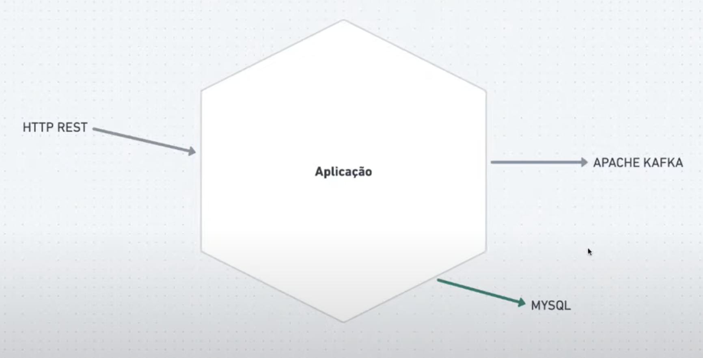

# Go Language Study Project - Simple Messaging Service


This project is part of the "Imersão Full Cycle 12" program and aims to provide a hands-on learning experience for participants interested in deepening their knowledge of the Go programming language. The project serves as a starting point for studying and practicing Go. This project is based on this class: <a href="https://www.youtube.com/watch?v=U1pbgs1l3WQ">APIs e Mensageria com Golang</a>

## Introduction

This is a study project that focuses on the Go programming language. It provides a simple application that demonstrates various aspects of Go development, including working with interfaces, repository operations, go routines, basic server setup, and read and deserialize messages from kafka. The project is designed to be easy to understand and navigate, making it suitable for both beginners and experienced developers who want to explore Go.



## Installation

To set up the project locally, make sure you have Docker and Docker Compose installed on your system.

1. Clone the repository:

```bash
git clone https://github.com/davimelovasc/go-simple-messaging-service
```

2. Change to the project directory:

```bash
cd go-simple-messaging-service
```

3. Build and run the application using Docker Compose:

```bash
docker-compose up -d
```

This command will start the application and its dependencies in separate Docker containers.

## First time setup

Once you have completed the installation steps, you will need create database table and kafka topic. Open a bash in your mysql container and connect in your db:

```bash
docker-compose exec mysql bash
mysql -uroot -p products 
```
insert the default mysql password <b>root</b>, and create the products table: 

```bash
create table products (id varchar(255), name (varchar255), price float);
```

To create the topic on kafka, open a bash in your kafka container and create it:
```bash
docker-compose exec kafka bash
kafka-topics --bootstrap-server=localhost:9002 --topic=products --create
```

Now that everything is set up, run the application.

## Running the app

```bash
docker-compose exec goapp bash
go run cmd/app/main.go
```

This command will start the server, and you can access the application by making requests specified on the [http-calls.http](http-calls.http) file.
